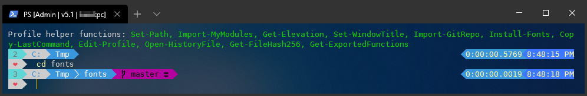
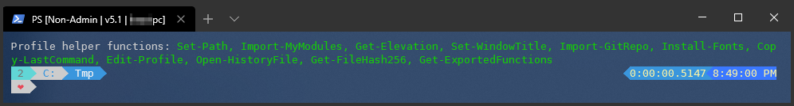

# TsekNet's Profile

My personal, heavily customized PowerShell profile.

To use this profile, place this file in your `$profile`
directory and restart your PowerShell console.

## Screenshots

PowerShell running in an administrative window while working on a git repo



PowerShell running in a non-admin window while working in `C:\Tmp`



## Getting Started

### Installation

Run the following from an administrative PowerShell prompt:

```powershell
iwr 'https://github.com/tseknet/Powershell-Profile/raw/master/install.ps1' -useb | iex
```

**_NOTE:_** When running this for the first time, the startup may take a minute to install all the required modules & fonts.

### Imported Modules

The following modules will be installed by default:

```powershell {.good}
posh-git
oh-my-posh
Get-ChildItemColor
```

## What's included

1. Set the PowerShell Window Title with useful information such as elevation and version.
2. Install/Import modules listed above.
3. Overwrite `ll` / `ls` / `history` commands for better results.
4. Download/Set personal theme [TsekNet.psm1](Themes/TsekNet.psm1).
5. Install Powerline fonts (https://github.com/PowerLine/fonts) using `posh-git`.
6. Set default path.

## Troubleshooting

Errors will be displayed to console, `$Error[0]` will have the latest error message if necessary for troubleshooting.

## Contributing

Please open a pull request with any issues you run into.

## License

This project is licensed under the MIT License - see the [LICENSE](LICENSE) file for details.

## Acknowledgments

* Hat tip to anyone whose code was used
* etc
